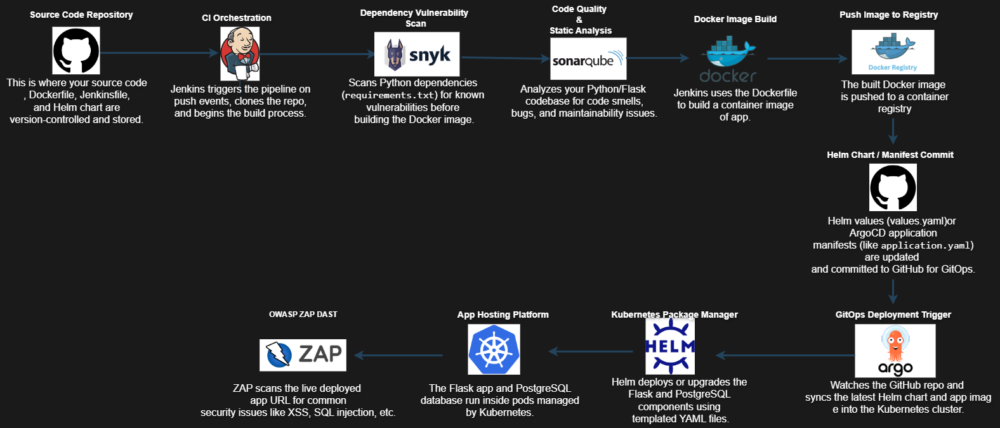
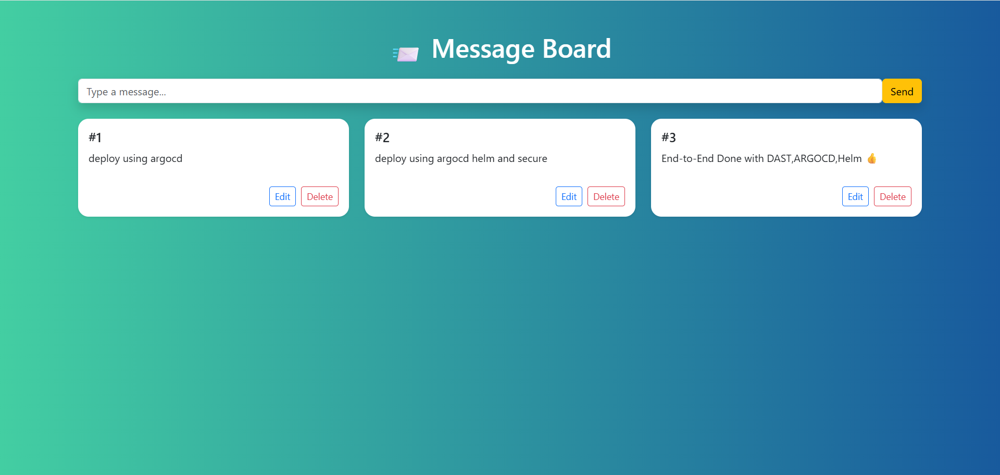
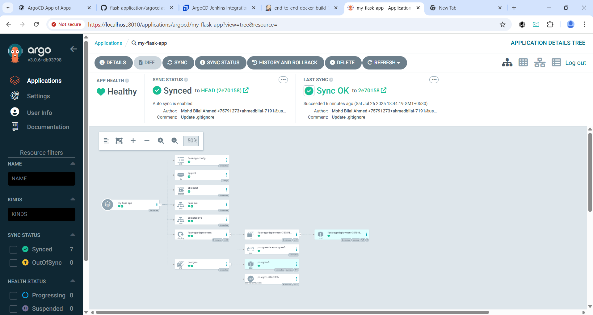

# 📝 Flask Message Board App (To-Do List)

A full-stack **Flask-based Message Board App** (like a to-do list) with a PostgreSQL backend and Jinja2-powered frontend. The app is containerized with Docker, deployed to Kubernetes using Helm and ArgoCD, and integrated with a CI/CD pipeline that includes security and quality scans (Snyk, SonarQube, OWASP ZAP DAST).

---

## 🏗️ Project Structure
<pre> 
project-root/
├── app/
│   ├── static/
│   │   ├── css/style.css
│   │   └── js/app.js
│   ├── templates/index.html
│   ├── __init__.py
│   ├── routes.py
│   └── db.py
├── config.py
├── run.py
├── helm-chart/
│   ├── Chart.yaml
│   ├── values.yaml
│   └── templates/
│       ├── deployment.yaml
│       ├── flask-config.yaml
│       ├── flask-svc.yaml
│       ├── postgres-pv.yaml
│       ├── postgres-statefulset.yaml
│       └── postgres-svc.yaml
├── argocd/application.yaml
├── .env.example
├── Dockerfile
├── docker-compose.yml
├── Jenkinsfile
└── README.md

 </pre>
---

## 💡 Features

- ✅ Flask app with routes and templates
- ✅ PostgreSQL as persistent DB
- ✅ Responsive UI using Jinja2 and CSS
- ✅ Dockerized backend
- ✅ Helm for Kubernetes deployment
- ✅ ArgoCD for GitOps-based deployment
- ✅ Jenkins for CI/CD orchestration
- ✅ Snyk for dependency vulnerability scanning
- ✅ SonarQube for static code analysis
- ✅ OWASP ZAP for DAST on the deployed app

---

## 🚀 CI/CD Pipeline

**Stages:**

1. **GitHub** – Source code management
2. **Jenkins** – CI/CD automation
3. **Snyk** – Dependency vulnerability scanning
4. **SonarQube** – Code quality checks
5. **Docker** – Build container image
6. **Docker Registry** – Push image to registry
7. **GitHub** – Commit Helm values / manifests
8. **ArgoCD** – GitOps deployment to cluster
9. **Helm** – Helm chart rendering and upgrade
10. **Kubernetes** – App runs inside cluster
11. **OWASP ZAP** – DAST scan post-deployment

---
## 💻 Working App Preview

Here’s how the Message Board App (To-Do List) looks in action:

> This app allows users to add, update, and delete tasks. The UI is built using Jinja templates with a clean, minimal frontend.

---

## 🚀 ArgoCD Deployment View

Below is a screenshot of the ArgoCD dashboard showing the deployed resources and sync status:

> This helps visualize how the application is deployed and managed on Kubernetes using GitOps principles.

## 🐳 Local Development

**1. Clone the repository**
  <pre><code>git clone https://github.com/your-username/message-board-app.git
cd message-board-app</code></pre>
**2. Rename the environment file**
  <pre><code>cp .env.example .env</code></pre>
**🔧 Run Without Docker**

> **Prerequisites:**
> +  Python 3.11
> +  PostgreSQL
> +  Virtualenv (optional)
> +  libpq-dev, gcc, and Python dev headers (on Linux)

**3.Install dependencies**
<pre><code>pip install -r requirements.txt</code></pre>

**4.Run the app manually**
<pre><code>gunicorn -w 4 -k gthread -b 0.0.0.0:5000 run:app</code></pre>

**5.🐋 Run with Docker**
<pre><code>docker build -t message-board-app:latest .
docker run -p 5000:5000 --env-file .env message-board-app:latest</code></pre>

**🐋 Run with Docker Compose (Recommended for local dev)**
<pre><code>docker-compose up --build</code></pre>

**☸️ Run with Helm (Kubernetes)**
>This assumes you have a Kubernetes cluster running and Helm installed.

**🛑 Important: Create the DB secret manually**

Create a file db-secret.yaml with your database password:

<pre><code>apiVersion: v1
kind: Secret
metadata:
  name: db-secret
  namespace: message-board
type: Opaque
stringData:
  POSTGRES_PASSWORD: your_db_password_here</code></pre>

Apply the secret:
<pre><code>kubectl create namespace message-board
kubectl apply -f db-secret.yaml</code></pre>

**🚀 Install the app with Helm**
<pre><code>helm install message-board ./helm-chart -n message-board -f helm-chart/values.yaml</code></pre>

**🔐 Security Scanning**
Snyk: Scans requirements.txt
SonarQube: Scans source code quality
OWASP ZAP: Scans live app for web vulnerabilities

**🧠 Tech Stack**
Backend	Flask (Python)
Frontend	Jinja2, HTML/CSS/JS
Database	PostgreSQL
Container	Docker
Orchestration	Kubernetes + Helm
Deployment	ArgoCD (GitOps)
CI/CD	Jenkins
Security	Snyk, SonarQube, ZAP

🙌 Credits
Created by Mohd Bilal Ahmed — Contributions welcome!

---
