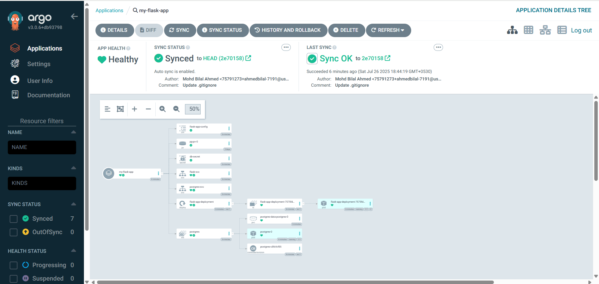

# 📝 Flask Message Board App (To-Do List)

A full-stack **Flask-based Message Board App** (like a to-do list) with a PostgreSQL backend and Jinja2-powered frontend. The app is containerized with Docker, deployed to Kubernetes using Helm and ArgoCD, and integrated with a CI/CD pipeline that includes security and quality scans (Snyk, SonarQube, OWASP ZAP DAST).

---

## 🏗️ Project Structure
<pre> 
project-root/
├── app/
│   ├── static/
│   │   ├── css/style.css
│   │   └── js/app.js
│   ├── templates/index.html
│   ├── __init__.py
│   ├── routes.py
│   └── db.py
├── config.py
├── run.py
├── helm-chart/
│   ├── Chart.yaml
│   ├── values.yaml
│   └── templates/
│       ├── deployment.yaml
│       ├── flask-config.yaml
│       ├── flask-svc.yaml
│       ├── postgres-pv.yaml
│       ├── postgres-statefulset.yaml
│       └── postgres-svc.yaml
├── argocd/application.yaml
├── .env.example
├── Dockerfile
├── docker-compose.yml
├── Jenkinsfile
└── README.md

 </pre>
---

## 💡 Features

- ✅ Flask app with routes and templates
- ✅ PostgreSQL as persistent DB
- ✅ Responsive UI using Jinja2 and CSS
- ✅ Dockerized backend
- ✅ Helm for Kubernetes deployment
- ✅ ArgoCD for GitOps-based deployment
- ✅ Jenkins for CI/CD orchestration
- ✅ Snyk for dependency vulnerability scanning
- ✅ SonarQube for static code analysis
- ✅ OWASP ZAP for DAST on the deployed app

---

## 🚀 CI/CD Pipeline


**Stages:**

1. **GitHub** – Source code management
2. **Jenkins** – CI/CD automation
3. **Snyk** – Dependency vulnerability scanning
4. **SonarQube** – Code quality checks
5. **Docker** – Build container image
6. **Docker Registry** – Push image to registry
7. **GitHub** – Commit Helm values / manifests
8. **ArgoCD** – GitOps deployment to cluster
9. **Helm** – Helm chart rendering and upgrade
10. **Kubernetes** – App runs inside cluster
11. **OWASP ZAP** – DAST scan post-deployment

---
## 💻 Working App Preview

Here’s how the Message Board App (To-Do List) looks in action:


> This app allows users to add, update, and delete tasks. The UI is built using Jinja templates with a clean, minimal frontend.

---

## 🚀 ArgoCD Deployment View

Below is a screenshot of the ArgoCD dashboard showing the deployed resources and sync status:



> This helps visualize how the application is deployed and managed on Kubernetes using GitOps principles.


## 🛠️ Initial Setup & Environment Installation

Follow these steps to set up the full CI/CD + Kubernetes environment from scratch.

## 1️⃣ Setup Jenkins Master & Agent

### On both Master & Agent (Ubuntu/Debian):
```bash
sudo apt update
sudo apt install openjdk-17-jdk -y
```

### Install Jenkins (Master only):
```bash
wget -q -O - https://pkg.jenkins.io/debian-stable/jenkins.io.key | sudo apt-key add -
sudo sh -c 'echo deb https://pkg.jenkins.io/debian-stable binary/ > /etc/apt/sources.list.d/jenkins.list'
sudo apt update
sudo apt install jenkins -y
```

### SSH Setup between Master and Agent (No dedicated Jenkins user):

On ```Master```:
```bash
ssh-keygen -t rsa -b 4096
ssh-copy-id ubuntu@<agent-public-ip>
```

### Add Node in Jenkins (Master UI):

- Go to Manage Jenkins → Nodes and Clouds → New Node

- Remote root directory: /home/ubuntu

- Select Launch agent via SSH, provide host details and credentials.

## 2️⃣ Install Docker

### On both Master & Agent:
```bash
sudo apt update && sudo apt install docker.io -y
sudo usermod -aG docker $USER
newgrp docker
```
## 3️⃣ Install SonarQube Server (Web)
```
# Install unzip & curl if missing
sudo apt install -y unzip curl

SONAR_VERSION=10.8.0.0
curl -LO "https://binaries.sonarsource.com/Distribution/sonarqube/sonarqube-${SONAR_VERSION}.zip"

# Extract and move to /opt
unzip "sonarqube-${SONAR_VERSION}.zip"
sudo mv "sonarqube-${SONAR_VERSION}" /opt/sonarqube

#Make sure port 9000 is open in your EC2 Security Group
nano conf/sonar.properties
#Change:
#sonar.web.host=0.0.0.0
#sonar.web.port=9000

./bin/linux-x86-64/sonar.sh start
```

## Configure in Jenkins:

- Go to Manage Jenkins → System Configuration

- Add SonarQube server URL & authentication token.

- Under Global Tool Configuration, add SonarQube Scanner and select Install automatically.

## Set Quality Gate Webhook:

- Create webhook in SonarQube pointing to Jenkins Master (use ngrok to expose Jenkins to the internet).
  ```bash
  ngrok http 8080
  ```

## 4️⃣ Install & Configure Snyk
```bash
sudo apt-get install -y libpq-dev python3-dev build-essential python3-venv
npm install -g snyk
snyk auth <YOUR_SNYK_TOKEN>
```

- Store the Snyk token in Jenkins credentials for pipeline usage.

## 5️⃣ Install yq
```bash
sudo wget https://github.com/mikefarah/yq/releases/latest/download/yq_linux_amd64 -O /usr/local/bin/yq
sudo chmod +x /usr/local/bin/yq
yq --version
```

## 6️⃣ Install Kind (Kubernetes-in-Docker)
```bash
curl -Lo ./kind https://kind.sigs.k8s.io/dl/v0.22.0/kind-linux-amd64
chmod +x ./kind
sudo mv ./kind /usr/local/bin/kind
```

### Cluster Config (```kind-config.yaml```):
```yaml
kind: Cluster
apiVersion: kind.x-k8s.io/v1alpha4
nodes:
- role: control-plane
- role: worker
- role: worker
```

### Create Cluster:
```bash
kind create cluster --config kind-config.yaml
kind get clusters
```

## 7️⃣ Install kubectl
```bash
curl -LO "https://dl.k8s.io/release/$(curl -sL https://dl.k8s.io/release/stable.txt)/bin/linux/amd64/kubectl"
chmod +x kubectl
sudo mv kubectl /usr/local/bin/
```

## 8️⃣ Install ArgoCD
```bash
kubectl create namespace argocd
kubectl apply -n argocd -f https://raw.githubusercontent.com/argoproj/argo-cd/stable/manifests/install.yaml
kubectl get pods -n argocd
```

## 9️⃣ Install Helm
```bash
curl https://baltocdn.com/helm/signing.asc | sudo apt-key add -
sudo apt-get install apt-transport-https --yes
echo "deb https://baltocdn.com/helm/stable/debian/ all main" | sudo tee /etc/apt/sources.list.d/helm-stable-debian.list
sudo apt-get update
sudo apt-get install helm
```

This set up the whole pipeline + infra from scratch, including Jenkins Master-Agent, Docker, SonarQube, Snyk, Kind, kubectl, ArgoCD, Helm, and yq.


## 🐳 Local Development

**1. Clone the repository**
  <pre><code>git clone https://github.com/your-username/message-board-app.git
cd message-board-app</code></pre>
**2. Rename the environment file**
  <pre><code>cp .env.example .env</code></pre>
**🔧 Run Without Docker**

> **Prerequisites:**
> +  Python 3.11
> +  PostgreSQL
> +  Virtualenv (optional)
> +  libpq-dev, gcc, and Python dev headers (on Linux)

**3.Install dependencies**
<pre><code>pip install -r requirements.txt</code></pre>

**4.Run the app manually**
<pre><code>gunicorn -w 4 -k gthread -b 0.0.0.0:5000 run:app</code></pre>

**5.🐋 Run with Docker**
<pre><code>docker build -t message-board-app:latest .
docker run -p 5000:5000 --env-file .env message-board-app:latest</code></pre>

**🐋 Run with Docker Compose (Recommended for local dev)**
<pre><code>docker-compose up --build</code></pre>

**☸️ Run with Helm (Kubernetes)**
>This assumes you have a Kubernetes cluster running and Helm installed.

**🛑 Important: Create the DB secret manually**

Create a file db-secret.yaml with your database password:

<pre><code>apiVersion: v1
kind: Secret
metadata:
  name: db-secret
  namespace: message-board
type: Opaque
stringData:
  POSTGRES_PASSWORD: your_db_password_here</code></pre>

Apply the secret:
<pre><code>kubectl create namespace message-board
kubectl apply -f db-secret.yaml</code></pre>

**🚀 Install the app with Helm**
<pre><code>helm install message-board ./helm-chart -n message-board -f helm-chart/values.yaml</code></pre>

**🔐 Security Scanning**
Snyk: Scans requirements.txt
SonarQube: Scans source code quality
OWASP ZAP: Scans live app for web vulnerabilities

**🧠 Tech Stack**
Backend	Flask (Python)
Frontend	Jinja2, HTML/CSS/JS
Database	PostgreSQL
Container	Docker
Orchestration	Kubernetes + Helm
Deployment	ArgoCD (GitOps)
CI/CD	Jenkins
Security	Snyk, SonarQube, ZAP

🙌 Credits
Created by Mohd Bilal Ahmed — Contributions welcome!

---
